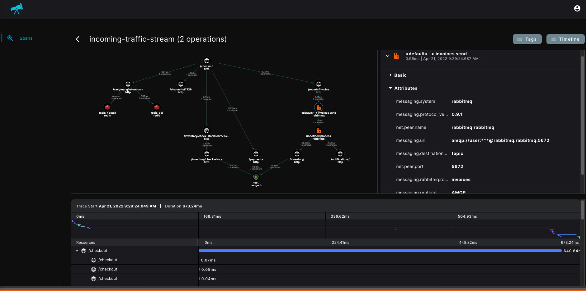

# otel-java

<p align="center">
 
  <a href="https://github.com/open-telemetry/opentelemetry-java-instrumentation/releases/tag/v1.13.0">
    
  </a>
  <a href="https://github.com/cisco-open/otel-java/actions/workflows/ci.yml">
    
  </a>
  <a href="https://github.com/cisco-open/otel-java/releases">
    
  </a>
</p>



This package provides OpenTelemetry-compliant tracing to Java
applications for the collection of distributed tracing and performance metrics in [Cisco Telescope](https://console.telescope.app/?utm_source=github).


## Contents
- [Installation](#installation)
    - [Download The Javaagent](#download-the-javaagent)
    - [Library initialization](#library-initialization)
    - [OpenTelemetry Collector Configuration](#opentelemetry-collector-configuration)
    - [Existing OpenTelemetry Instrumentation](#existing-opentelemetry-instrumentation)
- [Supported Runtimes](#supported-runtimes)
- [Configuration](#configuration)
- [Getting Help](#getting-help)
- [Opening Issues](#opening-issues)
- [License](#license)


## Installation


### Download the javaagent

Download the [latest version](https://github.com/cisco-open/otel-java/releases/latest/download/cisco-telescope-javaagent.jar)


### Library initialization
> Cisco OpenTelemetry Distribution is activated and instruments the supported libraries once the app has started with
> the javaagent 
>

* On Linux, run:
```shell
export OTEL_SERVICE_NAME=APP
export CISCO_TOKEN=<token>

java -javaagent:./cisco-otel-javaagent.jar \
  -jar <myapp>.jar
```

### OpenTelemetry Collector Configuration

> By default, Cisco OpenTelemetry Distribution exports data directly to [Cisco Telescope's](https://console.telescope.app/?utm_source=github) infrastructure backend.
> **Existing** OpenTelemetery Collector is supported, the following configuration can be applied

#### Configure custom trace exporter

> Cisco OpenTelemetry Distribution supports configure multiple custom exporters.
> Example for create OtlpGrpc Span exporter to local OpenTelemetry collector including metadata(headers) injection:

```shell
export OTEL_TRACES_EXPORTER=otlp
export OTEL_METRICS_EXPORTER=none
export OTEL_EXPORTER_OTLP_TRACES_ENDPOINT=http://localhost:4317

export OTEL_SERVICE_NAME=APP
export CISCO_TOKEN=<token>

java -javaagent:./cisco-otel-javaagent.jar \
  -jar <myapp>.jar
```


#### Configure custom OpenTelemetry collector to export trace data to [Cisco Telescope's](https://console.telescope.app/?utm_source=github) external collector.

```yaml
collector.yaml ...

exporters:
  otlphttp:
    traces_endpoint: https://production.cisco-udp.com/trace-collector
    headers:
      authorization: Bearer <Your Telescope Token>
    compression: gzip


service:
  pipelines:
    traces:
      exporters: [otlphttp]
```

### Existing OpenTelemetry Instrumentation

> Notice: Only relevant if interested in streaming existing OpenTelemetry workloads.
> [Cisco Telescope](https://console.telescope.app/?utm_source=github). supports native OpenTelemetery traces.


```shell
export OTEL_EXPORTER_OTLP_PROTOCOL=http/protobuf
export OTEL_METRICS_EXPORTER=none
export OTEL_EXPORTER_OTLP_TRACES_ENDPOINT=https://production.cisco-udp.com/trace-collector
export OTEL_EXPORTER_OTLP_HEADERS="authorization=Bearer <Your Telescope Token>"

java -javaagent:./opentelemetry_javaagent.jar \
  -jar <myapp>.jar
```

## Supported Runtimes

The agent works with Java runtimes version 8 and higher.


## Configuration
Cisco OTel Agent support all existing [Open Telemetry configurations](https://github.com/open-telemetry/opentelemetry-java-instrumentation/blob/main/docs/agent-config.md)
and provides new defaults for some of them.

In addition, Cisco OTel agent exports another set of Properties/Variables for the specific Cisco Agent configuration

Cisco OTel Agent configurations:

|System property                         |Environment variable          |Default          |Description
|----------------------------------------|------------------------------|-----------------|----------------|
|cisco.token                             | CISCO_TOKEN                  | None            | Cisco account token|
|otel.service.name                       | OTEL_SERVICE_NAME            | `application`   | Java service name|
|cisco.payloads_enabled                  | CISCO_PAYLOADS_ENABLED       | ```False```     | Whether to capture additional payloads and experimental attributes. Follow [Specifications](https://github.com/epsagon/cisco-otel-distribution-specifications) for more information.|
|cisco.debug                             | -                            | ```False```     | Enable debug prints for troubleshooting|


Open Telemetry defaults:

|System property                         |Environment variable          |Default          |Description    
|----------------------------------------|------------------------------|-----------------|----------------|
|OTEL_METRICS_EXPORTER                   | otel.metrics.exporter        | None            | By default, metrics are currently not supported|
|OTEL_INSTRUMENTATION_RUNTIME-METRICS_ENABLED                           | otel.instrumentation.runtime-metrics.enabled        | None            | By default, metrics are currently not supported|
|OTEL_TRACES_EXPORTER                   | otel.traces.exporter          | otlp-http            | Otlp over HTTP exporter|
|OTEL_EXPORTER_OTLP_ENDPOINT                   | otel.exporter.otlp.endpoint        |     https://production.cisco-udp.com/trace-collector        | The Cisco Otlp-gRPC collector URL path|

## Getting Help

If you have any issue around using the library or the product, please don't hesitate to:

- Use the [documentation](https://docs.telescope.com).
- Use the help widget inside the product.
- Open an issue in GitHub.

## Opening Issues

If you encounter a bug with the Cisco OpenTelemetry Distribution for JavaScript, we want to hear about it.

When opening a new issue, please provide as much information about the environment:

- Library version, JavaScript runtime version, dependencies, etc.
- Snippet of the usage.
- A reproducible example can really help.

The GitHub issues are intended for bug reports and feature requests.
For help and questions about [Cisco Telescope](https://console.telescope.app/?utm_source=github), use the help widget inside the product.

## License

Provided under the Apache 2.0. See LICENSE for details.

Copyright 2022, Cisco
